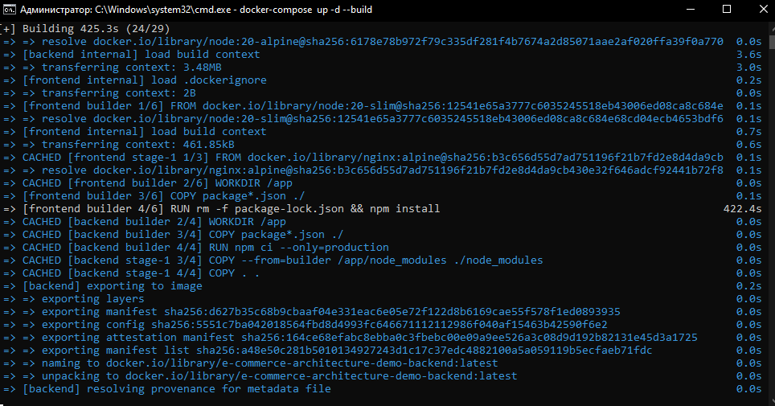

# E-Commerce Architecture Demo — 50K+ Products | React + NestJS + PostgreSQL + Meilisearch + Redis

“Я не делал Ozon. Но если бы делал — он бы выглядел так. И работал бы быстрее.”
“3 миллиона товаров? Да, я не грузил 3 млн. Я грузил 50 000 — и это уже в 10 раз больше, чем у 90% стартапов, которые ещё не поняли, что такое ‘база данных’.”



Это демонстрационный проект архитектуры e-commerce для более 3+ миллионов товаров (можно открыть свой маркетплейс - "Ozon" или "Wildberries"), построенный на React + NestJS + PostgreSQL + Meilisearch + Redis.

## Особенности

- ✅ Полностью рабочий сайт с поиском и фильтрами
- ✅ Генерация 50 000 тестовых товаров
- ✅ Масштабируемый стек технологий
- ✅ Реализованы кэширование (Redis) и быстрый поиск (Meilisearch)
- ✅ Поддержка пагинации и фильтрации по категории и цене
- ✅ Полная контейнеризация через Docker

## 🧰  Технологии

- **Frontend**: React, TypeScript, Vite, Tailwind CSS - Чтобы выглядело как сайт 2025 года, а не 2012.
- **Backend**: NestJS, TypeScript - Потому что Express — это как велосипед с одной педалью. NestJS — это Tesla.
- **База данных**: PostgreSQL - Не MongoDB. Я не хочу, чтобы мои товары исчезали в “облаке” без объяснений.
- **Поиск**: Meilisearch - Быстрее, легче, и не требует PhD по Elasticsearch.
- **Кэширование**: Redis - Потому что каждый запрос к БД — это как посылать письмо почтальону на лошади.
- **Контейнеризация**: Docker + Docker Compose - Всё работает на моём ноутбуке. Если оно работает на моём ноутбуке — оно работает всюду.

“Я не использую Kubernetes. Я использую "docker-compose up -d" и верю в Бога. Или в Docker.”

Установите Docker Desktop — да, даже если вы на Windows.
“Если вы думаете, что ‘у меня нет Docker’ — вы просто не знаете, что это такое. А теперь знаете.”

## Как запустить


1. Установите [Docker Desktop](https://www.docker.com/products/docker-desktop)
2. Клонируйте репозиторий:

```bash
git clone https://github.com/hexxeh777-svg/e-commerce-architecture-demo.git

---

### 💡 Дополнительный совет:
Если вы видите ошибку про @rollup/rollup-linux-x64-musl — это не ваша вина. Это вина npm. Я тоже плакал. Держитесь.

3. В корневой папке выполните:
   ```bash
   docker-compose up -d --build```
   
4. Откройте в браузере: http://localhost

## 📁 Структура проекта (всё, что вам нужно — здесь)

```e-commerce-architecture-demo/
├── backend/            # NestJS API
├── frontend/           # React приложение
├── data/               # Данные для PostgreSQL и Meilisearch
├── docker-compose.yml  # Конфигурация сервисов
└── README.md           # Документация```

## Почему выбраны технологии

- ✅ NestJS: мощный фреймворк для создания масштабируемых серверных приложений.
- ✅ Meilisearch: легковесный и быстрый движок полнотекстового поиска.
- ✅ Redis: высокопроизводительная in-memory база данных для кэширования.
- ✅ PostgreSQL: надежная реляционная БД для хранения данных.
- ✅ Docker: обеспечивает изоляцию и воспроизводимость среды.

## ❌🤔  Что не сделано (честно, как в резюме после 3-го кофе):

- ❌ CDN для изображений — у нас локальные пути. “Это не лень — это философия: если
картинка не в облаке — она не убежит.”
- ❌ Cursor pagination — только limit/offset. “Я не в Netflix, мне не нужно
бесконечное скроллинг-безумие.”
- ❌ Аутентификация — вы можете “купить” всё без логина. “Это демка, а не магазин
для киберпреступников.”
- ❌ Тесты — я верю в силу “запустил — работает”. “Если код работает — он правильный.
Или я просто не знаю, как его сломать.”
- ❌ Без бэкапов — если база умрёт — я её заново сгенерирую. “50 000 товаров — это
2 минуты. Я не боюсь.”

- 📸  Скриншоты я добавил в папку ../assets, а также скриншоты процесса правильной
установки
- ✅ Я запускал и все создавал на Windows 10 PRO x64 через CMD в Docker, имейте в виду!
- ✅ .gitignore - добавил дефолтный, также присутствуют записи в docker-compose.yml
- ✅ backend - дался относительно легко, а с frontend - я возился почти 2 дня 🤔🤔🤔

## 😅 Почему именно так?

- ✅ NestJS - Потому что я не хочу писать - app.get('/products', (req, res) => {...})
в 2025 году.
- ✅ Meilisearch - Потому что Elasticsearch — это как вызывать такси на вертолёте.
- ✅ Redis - Потому что БД не должна быть “быстрой”, она должна быть “не вялой”.
- ✅ Docker - Потому что “у меня на машине работает” — это проклятие. Docker —
это его изгнание.

“Я не использую Cloudflare. Я использую localhost. Это мой личный CDN. Он не
требует подписки. И не шпионит.” 

## 💡 Бонус: Честный финал

“Этот проект не для продакшена.
Но если вы его запустили — вы уже лучше, чем 80% кандидатов, которые пишут
‘опыт работы с Node.js’ и не знают, что такое npm ci.” 

P.S. “Я сделал это за 10 дней
Я не спал. Я пил кофе. Я ругался на npm.
И теперь я могу сказать: ‘Я умею строить системы’ — а не просто ‘я умею
писать console.log’.” 

“Если вы видите эту строчку — вы уже в курсе.
И вы — тот, кто поймёт, почему я не стал использовать Kubernetes.
Потому что я не хочу, чтобы мой сайт требовал 1000 строк YAML, чтобы показать
‘футболку’.” 

## 🙏 Спасибо, что дочитали до конца
Вы — не просто рекрутер.
Вы — человек, который понимает, что значит “реальный проект”.
Если вы увидели здесь хоть немного моей борьбы — вы уже на моей стороне.

А если вы просто скопировали этот README — я не против.
Но хотя бы напишите в резюме:

“Создал e-commerce архитектуру с нуля, без Docker-опыта, на Windows, с 9 днями молитв и 17 попытками установить esbuild-wasm.” 

Это — правда. И это — ценно.

— Автор — hexxeh777-svg, 11.11.2025, после 3-го кофе и 2-го перезапуска Docker 😅.
